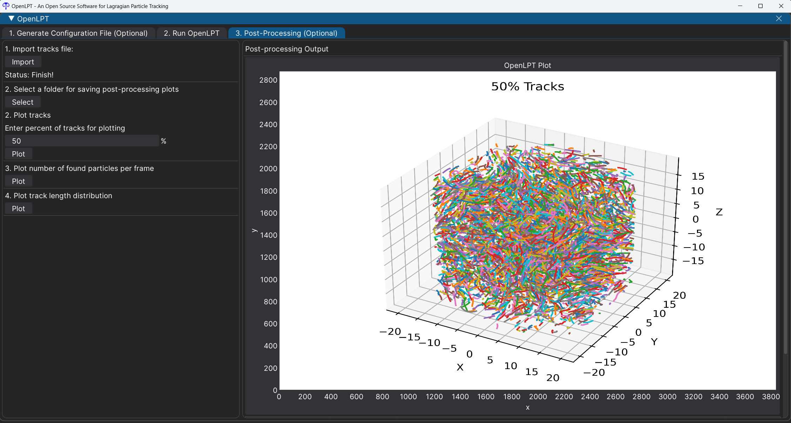

# Summary

In experimental fluid dynamics, the velocity of the flow can be measured by capturing the motion of numerous small tracer particles that accurately follow the flow [@papantoniou1989analyzing; @nishino1989three]. Lagrangian particle tracking is one of the most popular ways to extract the flow information, which can obtain longer particle trajectories than the other methods [@schanz2016shake; @tan2020introducing; @shnapp2022myptv; @barta2024proptv]. Such advantage makes this method widely applied for studying particle dispersion, mixing, and other transport-related quantities [@tan2022universality; @godbersen2021beauty; @qi2022fragmentation; @schroder20233d; @masuk2021towards; @tan20233d], which is essential for the study of multiphase flows. The idea of Lagrangian tracking is to first reconstruct 3D positions of particles based on images from each syncronized camera; and then link the positions at different frames to generate particle trajectories. By using iterative particle reconstruction algorithm [@wieneke2012iterative], the number and accuracy of reconstructed 3D particles can be highly increased. With shake-the-box algorithm [@schanz2016shake], the length of particle trajectories can be extended faciliating the study of long-time dispersion [@tan2022universality]. The optimized code, known as `OpenLPT`, has been well-established and made available on Github [@tan2020introducing]. However, despite its robustness, the code was written in C++ without a user-friendly API or GUI, which poses challenges for the community to compile and use. In this work, we present an updated version of this code with user-friendly GUI and python-based API, dedicated to making OpenLPT more accessible to the scientific community.

# Statement of need

`pyOpenLPT` is an OpenLPT-affiliated Python package for three dimensional Lagrangian particle tracking. 
The source code, written in C++, is designed to handle dense particle tracking ($\sim O(5\times10^4)$). Compared with the old version [@tan2020introducing], several new features have been added: (1) the polynomial camera model is added to the new code; (2) have more capability of calibraiton; and (3) flexibility with number of cameras and reduced cameras. 

The new code has also been restructured and organized to be more modular and extendable, making it easier to incorporate new features, such as complex object identification, tracking, and simultaneous tracking of multiple types of objects.
The Python package, `pyOpenLPT`, wraps the low-level code written in C++, keeping its high efficiency without losing flexibility or ease-of-use in the user-interface. The installation for this package can be finished in several lines and is compatible to both Windows and Linux systems. 

The GUI for `pyOpenLPT`, called `OpenLPTGUI`, is designed to offer a user-friendly graphical interface, making it accessible for users of all backgrounds to apply Lagrangian particle tracking for flow measurement. The interface features a clear, step-by-step workflow, and comprehensive documentation is included in the code folder. The workflow includes: calibration points extraction, camera calibration, image pre-processing, tracking, and camera parameter optimization (see \autoref{fig:GUI_main}). A sample results with 50% of tracks is shown in \autoref{fig:GUI_tracks}.

The code family (`OpenLPT`, `pyOpenLPT` and `OpenLPTGUI`) has already been
used in a number of scientific publications [@salibindla2020lift; @qi2020towards; @masuk2021simultaneous; @salibindla2021experimental; @masuk2021orientational; @masuk2021towards; @qi2022fragmentation; @tan2022universality; @tan2023scalings]. With the new version of the code family, the advanced software can be more easily adopted by the experimental community, enabling more researchers to obtain high-quality 3D flow measurements and make exciting new discoveries.

# Current capabilities

`pyOpenLPT`, currently in version 0.1.0, includes all the essential code required to extract 3D particle trajectories from image data. At present, the code does not support 2D tracking, nor does it integrate the functionality for tracking spherical objects [@tan20233d], but both features are planned for inclusion in future versions.

# Test dataset

A test dataset for tracking 3D tracer particles is provided at [`test_STB`](https://github.com/clockj/OpenLPT/tree/main/test/inputs/test_STB). Calibrated camera files are located in the subfolder `camFile`, and synthetic image files are located in the subfolder `imgFile`. Users need to modify the paths in the configuration files and image path files.

# References